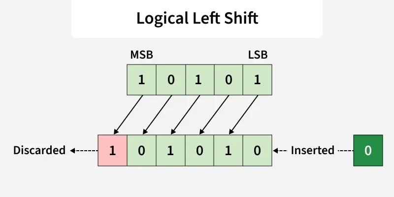

Bitwise operators work directly on binary bits ($0$ and $1$). 

Since computers store all data in binary form, 
bitwise operations help in manipulating data at the lowest level.

| Operator                                       | Logical                                                                        | Bitwise | Example                                           |
|------------------------------------------------|--------------------------------------------------------------------------------|---------|---------------------------------------------------|
| AND <small>Conjunction</small>              | $\land$ <small>or</small>  $\cdot$ <small>or</small>  `and`              | `&`     | $A \land B$  $A \cdot B$                       |
| OR  <small>Disjunction </small>             | $\lor$ <small>or</small>  $+$ <small>or</small>  `or`                    | `\|`    | $A \lor B$  $A + B$                            |
| NOT  <small>Negation </small>               | $\neg$ <small>or</small>  $\overline{\text{X}}$ <small>or</small>  `not` | `~`     | $\neg A$  $\overline{A}$  $A'$              |
| NAND  <small>Inverted AND </small>          | $\overline{\land}$                                                             | `~&`    | $\overline{A \land B}$  $\overline{A \cdot B}$ |
| NOR  <small>Inverted OR)</small>            | $\overline{\lor}$                                                              | `~`     | $\overline{A \lor B}$  $\overline{A + B}$      |
| XOR  <small>Exclusive OR </small>           | $\oplus$                                                                       | `^`     | $A \oplus B$                                      |
| XNOR  <small>Exclusive NOR </small>         | $\odot$ <small>or</small>  $\overline{\oplus}$                              |         | $A \odot B$  $\overline{A \oplus B}$           |

## Uses

 🚀 Used in optimization, performance-critical code, masking, toggling bits, and low-level programming.
 
 ⚡ Used to perform fast calculations and binary manipulation.

 🚦 Help in setting, clearing, checking, and toggling bits.

## Bitwise operations' features

 🏃 Often faster for low-level and bit-manipulation tasks.

 🎏 Enable packing multiple flags into a single variable, reducing memory usage.

# Bitwise Operators / Basics of Bit manipulation

Bit manipulation works on binary bits ($0$ and $1$), making it fast and efficient. 
These operations are executed by the CPU’s **Arithmetic Logic Unit (ALU)** and are commonly used for 
optimization, efficient flag handling, and performance-critical tasks.

## Main Bitwise Operators:

 - **AND** `&`
 - **OR** `|`
 - **XOR** `^`
 - **NOT** `~`
 - **Left Shift** `<<`
 - **Right Shift** `>>`

## Truth Table

| `X` | `Y` | AND `X & Y` | OR `X \| Y` | XOR `X ^ Y` | NOT  `~ X` |
|-----|-----|----------------|----------------|----------------|---------------|
| $0$ | $0$ | $0$            | $0$            | $0$            | $1$           |
| $0$ | $1$ | $0$            | $1$            | $1$            | $1$           |
| $1$ | $0$ | $0$            | $1$            | $1$            | $0$           |
| $1$ | $1$ | $1$            | $1$            | $0$            | $0$           |

## Bitwise **AND** `&` Operator

The `&` operator takes two *equal-length bit patterns* as parameters. 
The two-bit integers are compared. 
If the bits in the compared positions of the bit patterns are $1$, then the resulting bit is $1$. If not, it is $0$.

### Truth Table

| `X` | `Y` | AND `X & Y` |
|-----|-----|----------------|
| $0$ | $0$ | $0$            |
| $0$ | $1$ | $0$            |
| $1$ | $0$ | $0$            |
| $1$ | $1$ | $1$            |

## Example:

Let $X$ = $7$ = $(111)_2$ and $Y$ = 4 = $(100)_2$ . 
Then Bitwise **AND** `&` of both, i.e. $X$ `&` Y will be $4$.

$$
\begin{array}{r@{\;\;}c@{\,}c@{\,}l@{\quad}l}
   & 1 & 1 & 1_2 & \\
\& & 1 & 0 & 0_2 & \\
\hline
   & 1 & 0 & 0_2 & = 4
\end{array}
$$

## Bitwise **OR** `|` Operator

The `|` Operator takes two equivalent length bit designs as boundaries; if the two bits in the looked-at position are $0$, the next bit is zero. If not, it is $1$.

| Input  <small>`A`</small> | Input  <small>`B`</small> | Output  <small>`A & B`</small> | Description       |
|------------------------------|------------------------------|-----------------------------------|-------------------|
| $0$                          | $0$                          | $0$                               | Both bits are $0$ |
| $0$                          | $1$                          | $1$                               | One bit is $1$    |
| $1$                          | $0$                          | $1$                               | One bit is $1$    |
| $1$                          | $1$                          | $1$                               | Both bits are $1$ |

## Example:

Let $X$ and $Y$ be two bit values , where $X$ = 7= $(111)_2$ and  $Y$ = 4 = $(100)_2$ . 

Bitwise **OR** `|` of $X$, $Y$:

$$
\begin{array}{r@{\;\;}c@{\,}c@{\,}l@{\quad}l}
   & 1 & 1 & 1_2 & \\
 | & 1 & 0 & 0_2 & \\
\hline
   & 1 & 1 & 1_2 & = 7
\end{array}
$$

## Bitwise **XOR** `^` Operator

**XOR** `^` $\implies$ **Exclusive OR**. 

Here, if bits in the compared position do NOT match their resulting bit is $1$ (Bitwise **XOR** `^` of two bit operands is $1$ if the bits are opposite, otherwise $0$.

### Truth Table

| `X` | `Y` | XOR `X ^ Y` |
|-----|-----|----------------|
| $0$ | $0$ | $0$            |
| $0$ | $1$ | $1$            |
| $1$ | $0$ | $1$            |
| $1$ | $1$ | $0$            |

### Example:

Take two bit values $X$ and  Y, where $X$ = 7= $(111)_2$ and  $Y$ = 4 = $(100)_2$ . Take Bitwise AND of both $X$ & $Y$

$$
\begin{array}{r@{\;\;}c@{\,}c@{\,}l@{\quad}l}
   & 1 & 1 & 1_2 & \\
\land & 1 & 0 & 0_2 & \\
\hline
   & 0 & 1 & 1_2 & = 3
\end{array}
$$

## Bitwise **NOT** `~` Operator

❗ Requires only one operand to operate, unlike other binary operators.

💎 Returns [**one’s complement**](# "The one’s complement of a binary number is obtained by toggling all bits in it, i.e, transforming the $0$ bit to $1$ and  the $1$ bit to 0.
") of a single input.

| `X` | NOT `~X` |
|-----|-------------|
| $0$ | $1$         |
| $1$ | $0$         |

### Example: 

Let $X$ = 9 = $(1001)_2$ , where $X$ is a *4-bit* value.

Take the Bitwise **NOT** `~` of X.
-missing-image- 

>  Explanation: The bitwise **NOT** `~` operator  flips every bit in the number. $1$ becomes $0$, and vice-versa.

#### Note: 

The output of `~` depends on how many bits a system uses. 

In a *4-bit* system, `~` $1001_2$ ($9$) becomes $0110_2$ ($6$). 

In an *8-bit* system, $9$ is stored with leading zeros as $0000 1001_2$. Flipping it yields $1111 0110$, which is completely different ($246$).

## **Left Shift** (`<<`)

The **Left Shift** operator is denoted by the double left arrow key (<<). The general syntax for **Left Shift** is shift-expression `<<` k. The left-shift operator causes the bits in shift expression to be shifted to the left by the number of positions specified by k. The bit positions that the shift operation has vacated are zero-filled.

**Note**: Every time we shift a number towards the left by $1$ bit it multiply that number by $2$.

{: .invert-img }
*Image credits: GeeksforGeeks.org*{: .image-caption }

Example:

Input: **Left Shift** of $5$ by $1$.

Binary representation of $5$ = $00101_2$ and 
**Left Shift** of $00101_2 by $1$ (i.e, $00101$ `<<` 1)
 
 -missing-image- 

Output: 10
>Explanation: Bits of 5 will be shifted by $1$ to left, resulting in $01010_2$ $\equiv$ $10$

Input: **Left Shift** of 5 by 2.

Binary representation of 5 = 00101 and  **Left Shift** of 001012 by $1$ (i.e, 00101 `<<` 2)
 -missing-image- 

Output: 20
>Explanation: Bits of 5 will be shifted by $1$ to left, resulting in $10100_2$ $\equiv$ $20$

Input: **Left Shift** of 5 by 3.

Binary representation of 5 = 00101 and  **Left Shift** of 001012 by $1$ (i.e, 00101 `<<` 3)
 -missing-image- 

Output: 40
>Explanation: All bit of 5 will be shifted by $1$ to left side and  this result in $01000_2$ $\equiv$ $40$

## **Right Shift** (`>>`)

The general syntax for the **Right Shift** is `>> k`
The `>>` operator causes the bits in shift expression to be shifted to the right by the number of positions specified by $k$. 
For unsigned numbers, the bit positions that the shift operation has vacated are zero-filled. 
For signed numbers, the sign bit is used to fill the vacated bit positions. 
In other words, if the number is positive, $0$ is used, and  if the number is negative, $1$ is used.

>    Note: Every time we shift a number towards the right by $1$ bit it divides that number by $2$.

logical_right_shift

Example:

Input: **Right Shift** of 5 by 1.
Binary representation of 5 = 00101 and  **Right Shift** of 00101 by $1$ (i.e, 00101 `>>` 1)
 -missing-image- 
**Right Shift** of 5 by 1

Output: 2
Explanation: All bit of 5 will be shifted by $1$ to Rightside and  this result in 00010Which is equivalent to 2

Input: **Right Shift** of 5 by 2.
Binary representation of 5 = 00101 and  **Right Shift** of 00101 by 2 (i.e, 00101 `>>` 2)
 -missing-image- 
**Right Shift** of 5 by 2

Output: 1
Explanation: All bit of 5 will be shifted by 2 to Right side and  this result in 00001, Which is equivalent to 1

Input: **Right Shift** of 5 by 3.
Binary representation of 5 = 00101 and  **Right Shift** of 00101 by 3 (i.e, 00101 `>>` 3)
 -missing-image- 
**Right Shift** of 5 by 3

Output: 0
Explanation: All bit of 5 will be shifted by 3 to Right side and  this result in 00000, Which is equivalent to 0

Application of Bit Operators

Bit operations are used for the optimization of embedded systems.
The Exclusive-or operator can be used to confirm the integrity of a file, making sure it has **NOT** `~` been corrupted, especially after it has been in transit.
Bitwise operations are used in Data encryption and  compression.
Bits are used in the area of networking, framing the packets of numerous bits which are sent to another system generally through any type of serial interface.
Digital Image Processors use bitwise operations to enhance image pixels and  to extract different sections of a microscopic image.