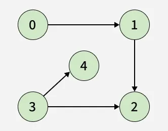

📌 A `topological sort` or
`topological ordering` of a **DAG** is a linear ordering of vertices such that:

- for every directed edge $u \to v$, $u$ comes before $v$ in it.

>For instance, the *vertices* of the graph may represent tasks to
>be performed, and the *edges* may represent constraints that one
>task must be performed before another; in this application, a
>topological ordering is just a valid sequence for the tasks.

📌 For a Graph $G$:

- Topological sort is possible $\iff$ $G$ has
no directed cycles $\iff$ $G$ is a [DAG](https://en.wikipedia.org/wiki/Directed_acyclic_graph). 

📌 Any DAG has *at least one* topological ordering.

🚀  Algorithms are known for constructing a topological ordering of any DAG in **linear time** $\text{O}(V + E)$.

{: .invert-img }
*A topological ordering of a DAG: every edge in ordering goes from
earlier (upper left) to later (lower right).
A directed graph is acyclic $\iff$ if it has a topological ordering.*{: .image-caption }

## Examples

### 🔦 Example 1

{: .invert-img }

The graph shown above has many valid topological sorts, including:

>- `5, 7, 3, 11, 8, 2, 9, 10` (visual left-to-right, top-to-bottom)
>- `3, 5, 7, 8, 11, 2, 9, 10` (smallest-numbered available vertex first)
>- `5, 7, 3, 8, 11, 10, 9, 2` (fewest edges first)
>- `7, 5, 11, 3, 10, 8, 9, 2` (largest-numbered available vertex first)
>- `5, 7, 11, 2, 3, 8, 9, 10` (attempting top-to-bottom, left-to-right)
>- `3, 7, 8, 5, 11, 10, 2, 9` (arbitrary)

### 🔦 Example 2

#### Input: 

`adj[][] = [[1], [2], [], [2, 4], []]`

{: .invert-img }
*Image credits: GeeksForGeeks.org*
{: .image-caption }

#### Output: 

`[0, 3, 1, 4, 2]`

#### Explanation: 

>Since vertices $0$ and $3$ do not have any incoming edges from any other vertex, 
> they appear first in the topological ordering. 
> Next, vertex $1$ depends only on vertex $0$, 
> so it comes after $0$. 
> Similarly, vertex $4$ depends only on vertex $3$, 
> placing it after $3$. 
> Finally, vertex $2$ depends on both vertices $1$ and $3$, 
> so it appears after both of them in the ordering.

## Application

The canonical application of topological sorting is in
**scheduling a sequence of jobs** or tasks based on their dependencies. 

The jobs
are represented by vertices, and if there is an edge $x \to y$ then
job $x$ must be completed before job $y$ can be started 

>(for example, when washing clothes, the washing machine must finish
before we put the clothes in the dryer). Then, a topological sort
gives an order in which to perform the jobs.

Other application is **dependency resolution**. Each vertex is a package
and each edge is a dependency of package $a$ on package $b$. Then topological
sorting will provide a sequence of installing dependencies in a way that every
next dependency has its dependent packages to be installed in prior.

## Implementations

Commented out for the time.

[//]: # ()

[//]: # ()
[//]: # ()

[//]: # ()

[//]: # ()

[//]: # ()

[//]: # ()

[//]: # ()
[//]: # ()

[//]: # ()

[//]: # ()

[//]: # ()

[//]: # ()

[//]: # ()
[//]: # ()

## References

- [trekhleb/javascript-algorithms](https://github.com/trekhleb/javascript-algorithms/tree/master/src/algorithms/graph/topological-sorting)
- [Wikipedia](https://en.wikipedia.org/wiki/Topological_sorting)
- [Topological Sorting on YouTube by Tushar Roy](https://www.youtube.com/watch?v=ddTC4Zovtbc&list=PLLXdhg_r2hKA7DPDsunoDZ-Z769jWn4R8)